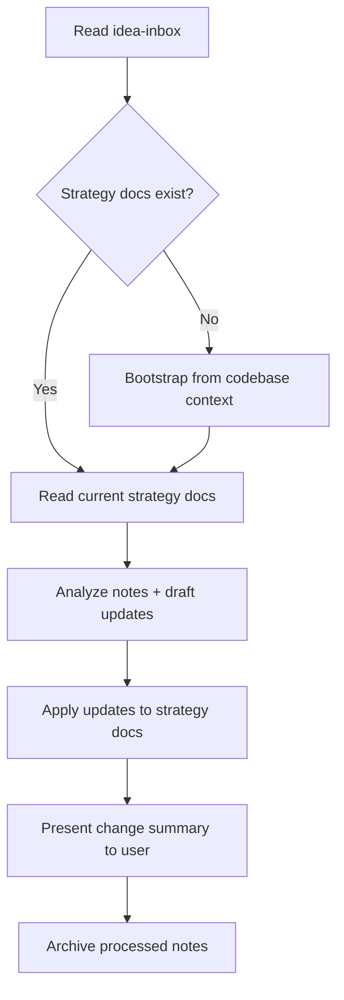

# Refine Product Strategy Skill

## Pain Point

The founder needs a low-friction way to capture rough ideas and have agents autonomously synthesize them into coherent, structured product strategy documents -- operating as senior autonomous team members rather than requiring micromanagement.

## Directory Structure

Create the following under the project root:

```
product/
├── idea-inbox/              # Founder drops freeform notes here
│   └── processed/           # Processed notes archived here automatically
└── strategy-vision/         # Source of truth for product direction
    ├── index.md             # Guide: what each doc covers and when to reference it
    ├── vision.md            # North Star: who, what, why, beliefs about the future
    ├── strategy.md          # How we win: positioning, landscape, differentiation
    ├── roadmap.md           # What's built, in progress, and planned
    ├── principles.md        # Decision-making framework: technical and org values
    └── decisions.md         # Key decisions, rejected approaches, rationale
```

### Why this document set (vs. what was originally proposed)

- **vision.md** consolidates "company-vision" and "product-vision" -- for a single-product project they're the same document. Covers: target user, pain points, why this product exists, what success looks like, non-goals, and beliefs about the future (the "working backward" angle).
- **strategy.md** covers the "how we win" dimension: market positioning, competitive landscape, revenue model, go-to-market. Separate from vision because strategy changes more often than vision.
- **roadmap.md** is the "what and when": shipped features, in-progress work, planned features, and priorities. Most frequently updated document.
- **principles.md** captures the operating guardrails: local-first vs cloud, build vs buy, speed vs reliability, etc. These are the shared values that give agents autonomy within boundaries.
- **decisions.md** is the institutional memory: what we decided, why, what we rejected, and what first-principles reasoning led us there. Prevents re-litigating settled questions.
- **index.md** ties it all together -- a quick-reference for both humans and agents explaining when to consult each document.

## Skill Design

Create at `.cursor/skills/refine-product-strategy/SKILL.md`

### Trigger scenarios (for the description field)

The agent should activate this skill when:

- User asks to "process my ideas" or "refine product strategy"
- User mentions the idea inbox or strategy documents
- User asks to update product vision, roadmap, or principles

### Workflow (5 steps)



**Step 1 -- Read inbox**: Read all markdown files in `product/idea-inbox/` (excluding `processed/`). Sort by file modification time, oldest first. More recent notes reflect more current thinking and take precedence on conflicts.

**Step 2 -- Bootstrap or read strategy**: If `product/strategy-vision/` doesn't exist, bootstrap it by reading project context (`README.md`, `AGENTS.md`, existing code) and creating initial documents with inferred content. Then read all current strategy documents.

**Step 3 -- Analyze and draft**: For each inbox note, determine which strategy documents are affected. Draft updates. When a note contradicts existing strategy, the note wins (it reflects newer thinking) -- but flag the contradiction in the change summary.

**Step 4 -- Apply updates and summarize**: Make the changes directly to the strategy documents. Present a concise summary of what changed and why, organized by document. This lets the user review the changes quickly (CEO review, not line-by-line approval).

**Step 5 -- Archive**: Move processed notes to `product/idea-inbox/processed/` with their original filenames. The user can always reference them there or via git history.

### Supporting files

- **templates.md**: Contains the initial template for each strategy document (section headers, brief descriptions of what belongs in each section). Used during bootstrap and as a reference for maintaining document structure.
- **examples.md**: 2-3 concrete examples showing: (a) a sample inbox note, (b) how it gets synthesized into strategy doc updates, (c) the resulting change summary. Helps the agent understand the expected quality bar.

### Inbox note conventions

Keep it zero-friction for the founder:

- Any markdown file in `product/idea-inbox/`
- No required format, frontmatter, or naming convention
- Recommended (not required) filename pattern: `YYYY-MM-DD-topic.md` for easy chronological scanning
- Notes can be a single sentence, a bulleted list, a stream of consciousness, or a structured doc -- the agent handles all formats

### Update principles (embedded in the skill)

- **Additive by default**: New ideas extend existing strategy, they don't replace it unless explicitly stated
- **Recency wins**: When notes conflict with existing docs, the more recent note takes precedence
- **Preserve voice**: Keep the founder's framing and language where possible; don't over-corporatize
- **Flag ambiguity**: If a note is unclear, add a `> [!NOTE] Needs clarification: ...` callout in the relevant strategy doc rather than guessing
- **Atomic sections**: Each strategy doc section should stand alone -- agents reading one section shouldn't need to read the whole doc to understand it

## AGENTS.md Update

Add a brief reference to the `product/` directory in `AGENTS.md` so all agents know to consult the strategy documents for product context and decision-making guidance.

## Files Created

- `product/idea-inbox/.gitkeep`
- `product/idea-inbox/processed/.gitkeep`
- `.cursor/skills/refine-product-strategy/SKILL.md`
- `.cursor/skills/refine-product-strategy/templates.md`
- `.cursor/skills/refine-product-strategy/examples.md`

## Files Modified

- `AGENTS.md` -- added Product Strategy section
